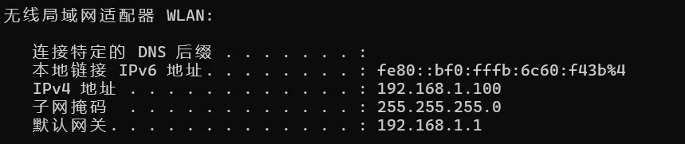
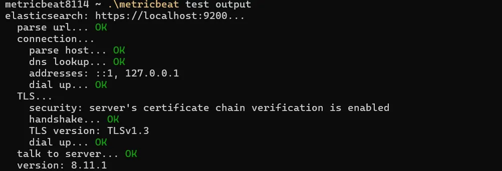

# `Metricbeat`安装

1. 下载安装: `sudo apt install curl``--->``curl -L -O https://artifacts.elastic.co/downloads/beats/metricbeat/metricbeat-8.11.1-linux-x86_64.tar.gz` `---`与`elasticsearch`版本一致
3. 下载解压: `tar xzvf metricbeat-8.11.1-linux-x86_64.tar.gz`
4. 文件命名: `sudo mv metricbeat-8.11.1-linux-x86_64 metricbeat8111`
5. 删除压缩: `sudo rm -f metricbeat-8.11.1-linux-x86_64` `sudo rm -f sudo metricbeat-8.11.1-linux-x86_64.tar.gz`
6. 参考文章: `https://www.elastic.co/guide/en/beats/metricbeat/8.11/metricbeat-installation-configuration.html`
# 基本配置
1. 环境准备: `https://www.yuque.com/shenzaixijiezhizhong/gbygqg/fxx2ocpdhr7ad5xp#JPpeqXShell` 连接虚拟机小节
2. 查看`IP`: 终端输入`ipconfig`命令`--->`无线局域网适配器`WLANIPV4`地址就是我们的`IP`地址`---`但是这个`IP`地址是会改变的
3. 复制目录: 将`elasticsearch8111config`目录下的`certs`目录复制到`metricbeat8111`目录下

4. 重要配置: 打开`metricbeat`的 `config` 目录中的`metricbeat.yml` 文件,做如下修改
```text
metricbeat.config.modules:
  # Glob pattern for configuration loading
  path: ${path.config}/modules.d/*.yml
  #设置 修改 metricbeat.yml 后，是否会自动装载 metricbeat.yml, 而不用重新启动 metricbea; true: 是
  # Set to true to enable config reloading
  reload.enabled: true
  

setup.kibana:
  host: "192.168.1.100:5601" 
  

output.elasticsearch:
  # Array of hosts to connect to.
  hosts: ["192.168.1.100:9200"]

  # Protocol - either `http` (default) or `https`.
  protocol: "https"

  # Authentication credentials - either API key or username/password.
  #api_key: "id:api_key"
  username: "liu"
  password: "liuxiansheng"
  ssl.certificate_authorities: ["./certs/http_ca.crt"] 
```
5. 配置测试: 终端打开`metricbeat8111``--->`输入`./metricbeat test output`

6. 信息保护: 终端打开`metricbeat8112``--->``./metricbeat keystore create``--->`输入`./metricbeat keystore add ES_USER` `--->`输入`ES`账号的用户名`liu``--->`输入`./metricbeat keystore add ES_PASSWORD``--->`输入`ES`账号的密码`liuxiansheng``--->`修改`metricbeat`的`config`目录中的`metricbeat.yml`文件为如下所示
> 补充: `./metricbeat keystore list`可以查看添加到`keystore`的变量
```text
output.elasticsearch:
  # Array of hosts to connect to.
  hosts: ["192.168.1.100:9200"]

  # Protocol - either `http` (default) or `https`.
  protocol: "https"

  # Authentication credentials - either API key or username/password.
  #api_key: "id:api_key"
  username: "${ES_USER}"
  password: "${ES_PASSWORD}"
  ssl.certificate_authorities: ["./certs/http_ca.crt"]
```

# 启动模块
1. 查看启动: 终端打开`metricbeat8114``--->`输入`sudo ./metricbeat.exe modules list`
> 补充: `system`模块是自启动的;`Enabled`启动/`Disabled`不启动
2. 禁止模块: `sudo ./metricbeat modules disable system``---`禁止 `system` 模块
3. 启动模块: `sudo ./metricbeat.exe modules enable nginx``---`启动`nginx` 模块

# 运行服务
1. 数据准备: 终端打开`metricbeat8111``--->`输入`./metricbeat setup -e`
2. `kibana`设置: 主机终端打开`kibana8111`目录下`kibana.yml``--->`添加`server.host: "0.0.0.0"``----`不要在第一次运行之前添加该属性,不然展示链接有问题

4. 启动`metricbeat`: 终端打开`metricbeat8111``--->`依次输入下列命令`---`先启动`kibana`
```bash
   sudo chown root metricbeat.yml
   sudo chown root modules.d/nginx.yml
   sudo ./metricbeat -e
```
4. `Kibana`查看模块: 访问`http://localhost:5601/` `--->`点击图标`--->`点击`Dashboard`


5. `Kibana`查看模块: 访问`http://localhost:5601/` `--->`点击图标`--->`点击`Discovery`
