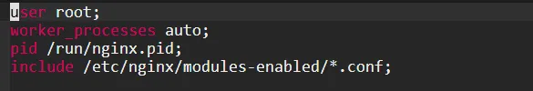

# 命令安装`Nginx`
1. 下载安装:`sudo apt update``--->``sudo apt install nginx -y`
2. 配置查看:`nginx -t``---`查看`Nginx`配置文件的路径
3. 目录结构: `cd /etc/nginx``--->``tree`
>  安装`tree`: `sudo apt install tree`
>  补充说明: 这些配置文件的作用建议直接问`chatgpt`
   - `nginx.conf`: 主配置文件
   - `conf.d`: 存放配置文件,这里的配置文件通常用于全局或通用配置  
   - `modules-available`: 存放可用的`Nginx`模块配置文件;每个模块都可以通过一个`.conf`文件进行配置
   - `modules-enabled`: 存放已启用的`Nginx`模块的符号链接;通过将`modules-available`目录中的模块配置文件链接到`modules-enabled`目录,可以启用相应的模块  
   - `sites-available`: 存放可用的虚拟主机配置文件,每个网站的配置文件都存放在这里  
   - `sites-enabled`: 存放已启用的虚拟主机符号链接,通过将`sites-available`目录中的配置文件链接到`sites-enabled`目录中的配置文件,可以启用相应的虚拟主机
   - `proxy_params`: 定义了代理服务器的参数,通常用于配置反向代理

4. 查看执行用户: `ps aux | grep nginx`,若显示非`linux`系统上的用户则说明不正确,这将导致部署后访问显示`403`

>  修改执行用户: `sudo micro /etc/nginx/nginx.conf``--->`将`user`改成`root``--->`保存退出 
>  

# `docker`安装`Nginx`
1. 参考: `https://blog.csdn.net/BThinker/article/details/123507820`